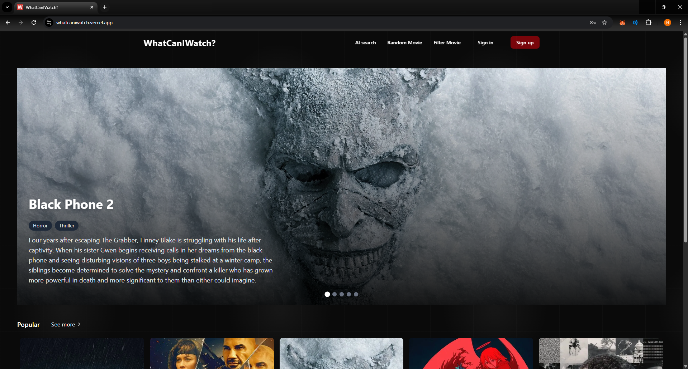
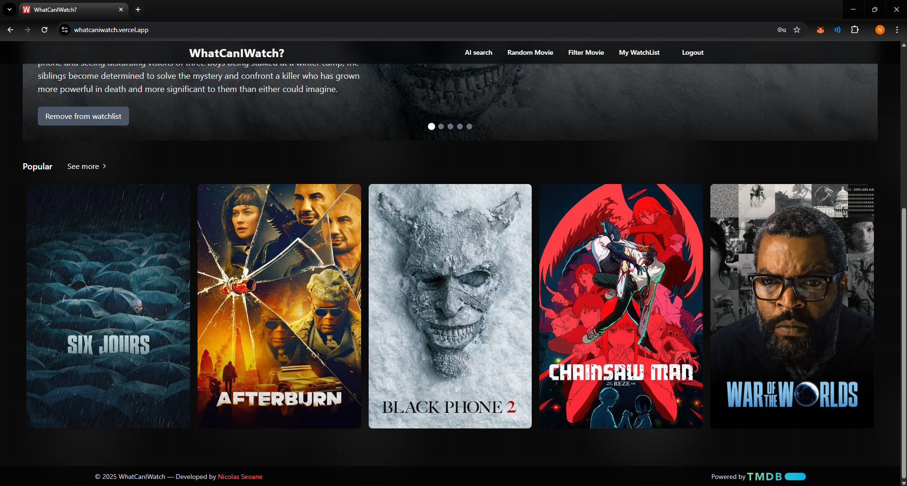
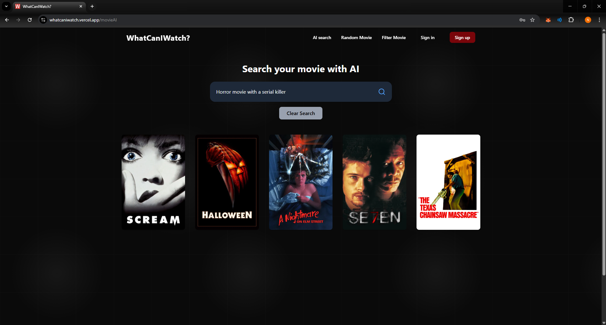
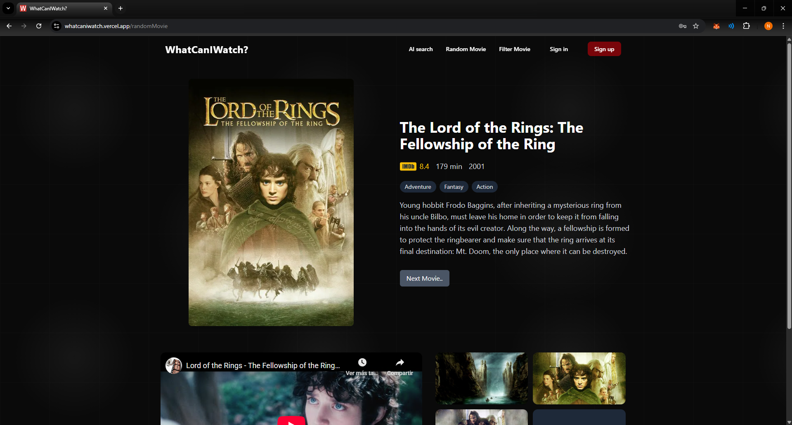
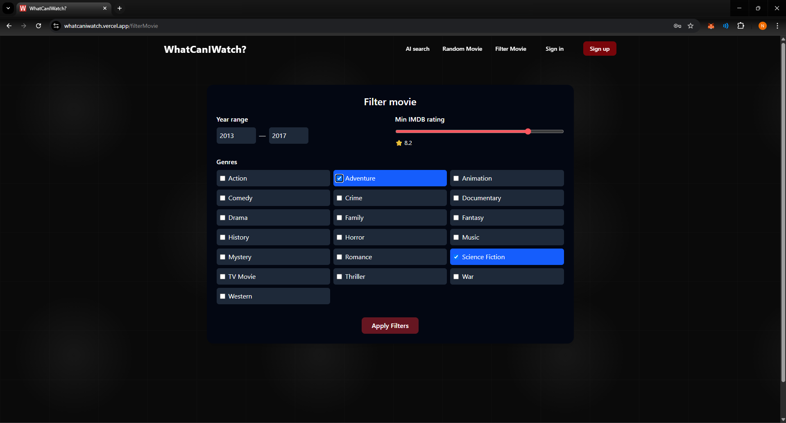
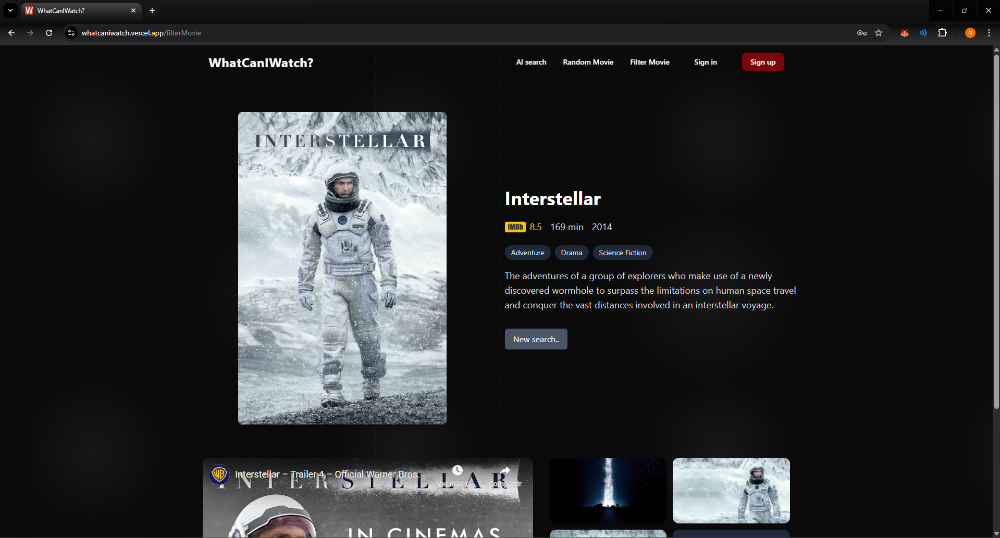
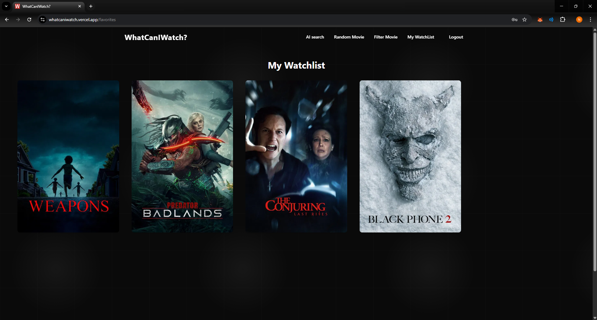
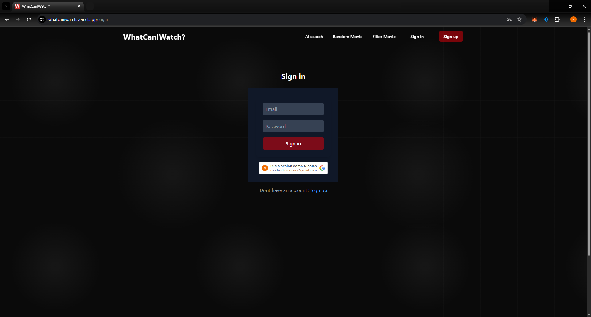

# 🎬 WhatCanIWatch – Movie Recommender App

Discover, filter, and save movies using the **TMDB API**, with **AI-powered recommendations**.  
WhatCanIWatch helps you decide what to watch next — combining classic filters with natural language search.

---

## 🔗 Project Repositories

- 🖥️ **Frontend (React + Vite + TailwindCSS)**  
  👉 [whatcaniwatch-frontend](https://github.com/NicolasSeoane/whatcaniwatch-frontend)

- ⚙️ **Backend (Node.js + Express + MongoDB)**  
  👉 [watcaniwatch-backend](https://github.com/NicolasSeoane/watcaniwatch-backend)

---

## 🚀 Live Demo

- 🌐 **WhatCanIWatch** [https://whatcaniwatch.vercel.app](https://whatcaniwatch.vercel.app)  

---

## 🧠 Overview

**WhatCanIWatch** is a full-stack movie recommender application that allows users to:
- 🔍 Filter movies by genre, year, IMDB rating  
- 🎲 Get random recomendations if you are not sure what you want to watch
- 🎭 Get AI-powered recommendations (“I want to watch something thrilling tonight”)  
- ❤️ Save favorites to a personal watchlist  
- 🔐 Log in with Email or Google  

---

## 🧩 Tech Stack

| Technologies |
|---------------|
| **Frontend** | React · Vite · TailwindCSS · Redux |
| **Backend** | Node.js · Express · MongoDB · Mongoose · JWT · Google OAuth |
| **AI Integration** | OpenAI API |
| **Infrastructure** | Vercel (frontend) · Render (backend) - Atlas DB (database)|

---

📸 Screenshots

👨‍💻 Author

Nicolás Seoane
📍 Montevideo, Uruguay
💼 [LinkedIn](https://www.linkedin.com/in/nicolas-seoane)
